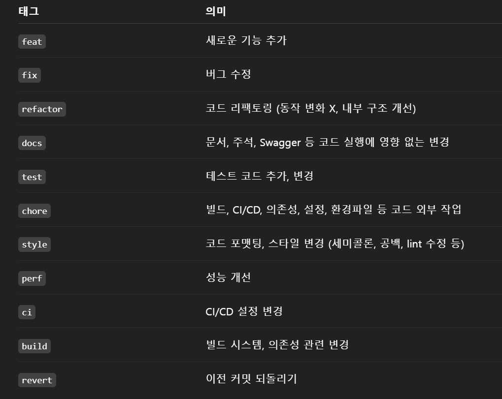

# API Server

---

## Environment

| 항목        | 내용                                         |
|-------------|--------------------------------------------|
| Java        | **17**<br>로컬에 Java 17 이상 설치되어 있으면  17로 빌드됨 |
| Kotlin      | 1.9.25                                     |
| Gradle      | 8.5 (Wrapper 사용 권장: `./gradlew`)           |
| Spring Boot | 3.4.5                                      |
| IDE         | IntelliJ IDEA (Ultimate 또는 Education 권장)   |


## 실행환경별 환경설정 분리

### 🔒 민감 정보 관리
- Docker: `.env` 필요 (compose env로 주입)
- Local: `application-secret.yml` 필요  

#### → xhae000@gmail.com으로 문의하여 파일 수령

---

### application.yml
```yaml
spring:
  profiles:
    active: dev,secret  # dev(secret), prod
```
### 환경설정 유의사항
  
  - **application-dev.yml / application-prod.yml** 은 환경에 맞게 분리하여 사용할 것
  - 실수로 운영 설정(prod)을 로컬에서 사용하는 등, 혼용하지 않도록 주의할 것
  - 환경별 민감한 정보(DB 계정 등)는 외부 Git 저장소에 노출되지 않도록 관리할 것

### Commit Rule
